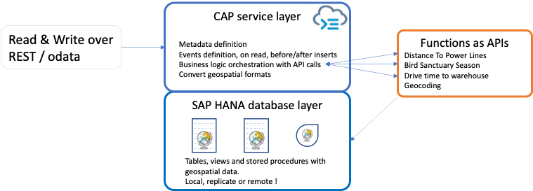

# Forest Sample CAP project


This sample project demonstrate how to use a data layer containing geospatial data types with CAP to provide:
- access through odata
- read and write access with transactional consistency
- business logic orchestration:
    - geo coding of addresses when new records are inserted
    - functional validation such as distance to power line or compliance with wildlife sanctuary locations and seasons.




## Next Steps

`git clone https://github.com/remi-sap/cap-forest.git` 
`cd cap-forest`

If you're not already logged, `cf login`

`cds deploy`

`cds watch`

Then open the [samples](./samples) folder.

Open [add_warehouse.http](./samples/add_warehouse.http) and click on "Send request"

Open [harvesting_block.http](./samples/harvesting_block.http) and click on "Send request"


# How does it all work ?

## Data layer
Tables are defined using CAP CDS, for instance:
<pre>
entity Warehouse {
  key ID   :   Integer;
  label    :   String(111) not null;
  surface  :   Integer;
  address  :   String(300) not null;

  //The fields below will be filled automatically if a valid address is provided
  geo_score:   Double;
  geo_point :  hana.ST_POINT;
  geo_city:    String(200);
  geo_county:  String(200);
  geo_country_iso3:  String(3);
}
</pre>

The geocoding process assigns values to the last 5 columns.

## CAP extensions

Tables are exposed as odata using [srv/Forest.cds](./srv/Forest.cds). 
However, we need to make some customizations.

CAP & odata don't fully support geospatial data types, so we need the odata module to ignore them and we'll handle the conversions ourselves.
The file **.cdsrc.json** contains this configuration:
```json
{"odata": { "asProvided": true } }
```

### Define javascript extensions

The odata service definition file [srv/Forest.cds](./srv/Forest.cds) has a javascript sibling [srv/Forest.js](./srv/Forest.js) that contains various code blocks:
* conversion between geospatial formats (binary, geojson, well known text)
* call to geocoding function
* functional validation of harvesting blocks. This is done by executing checks **in parallel** and returning OK when they all succeed.

